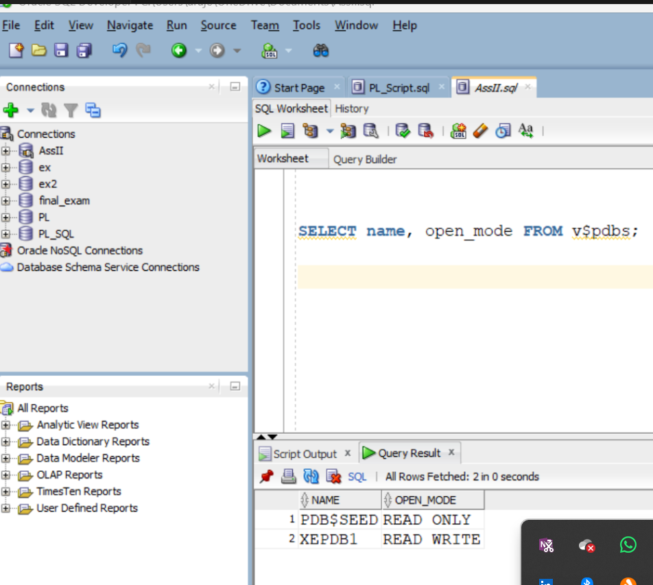
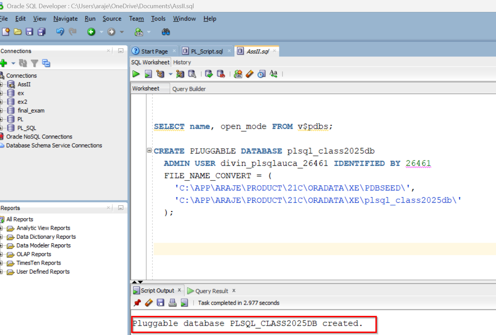
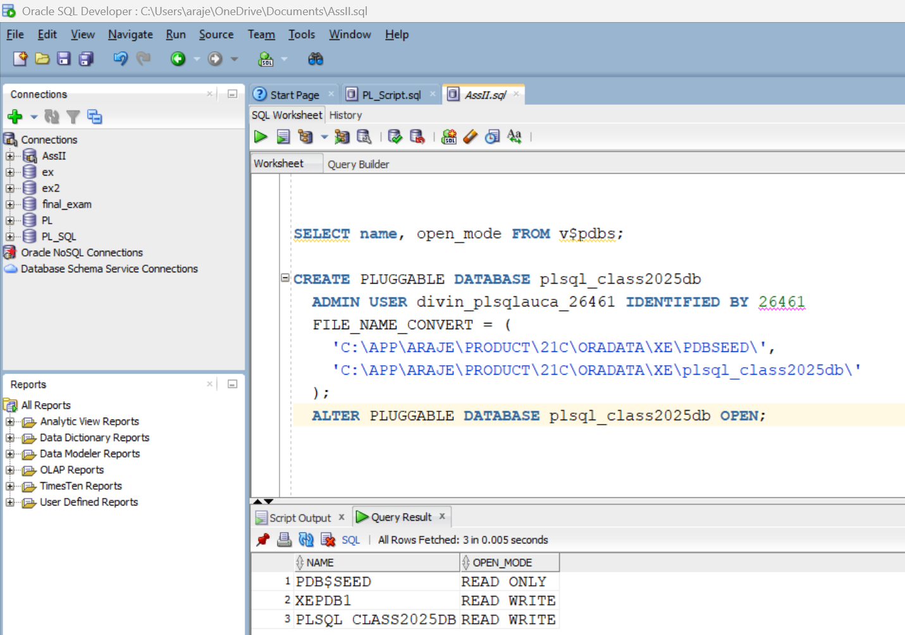
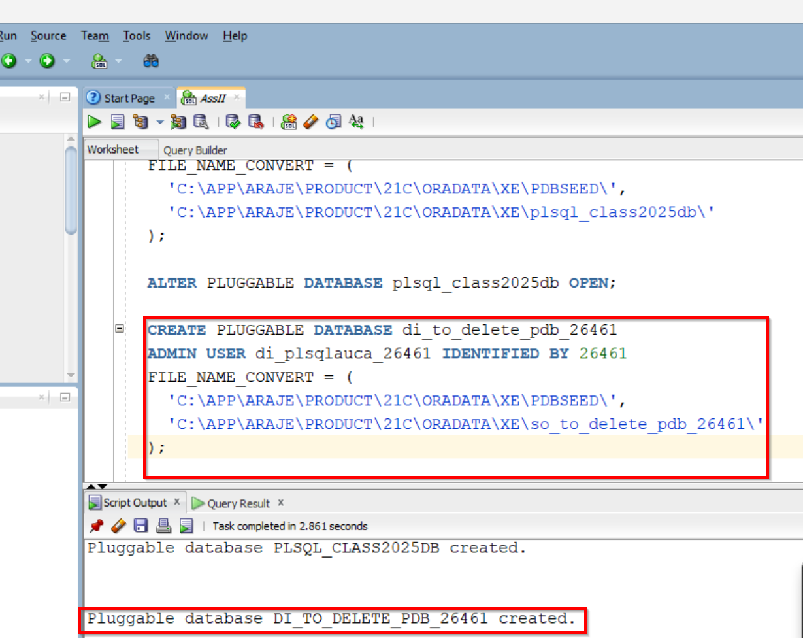
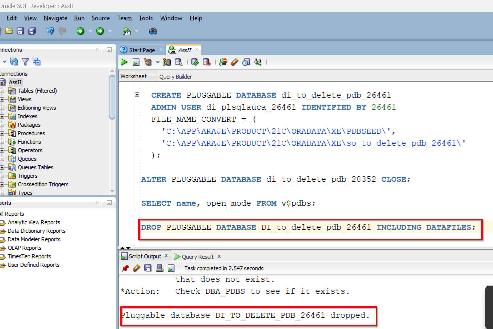
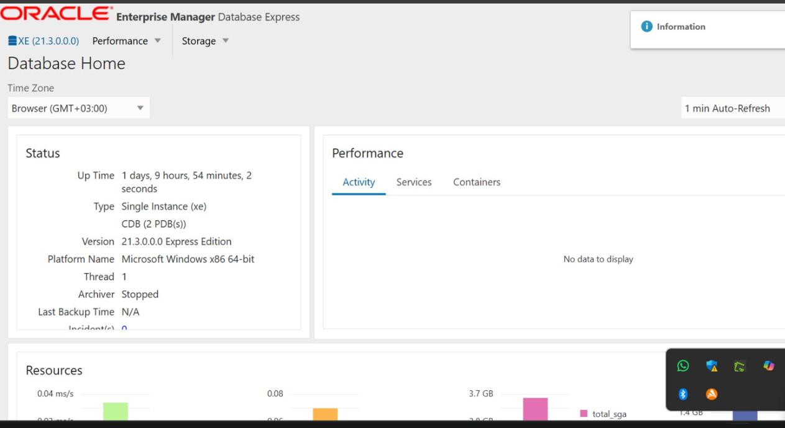

## Names: Araje Divin
## ID:26461
## Department: Software Engineering
## Courses: Database development with PL/SQL
 ## Instructor: Eric MANIRAGUHA
## Date: 06/10/2025
## PROJECT TOPIC: PL/SQL(PDBS)

## ALL TASKS: Create new PDBS,CREATE AND DELETE PDB,CREATE ORACLE 

## Task 1: 

First of all, I checked to verify and demonstrate the PDB that I already have in Oracle.

Then, I created a new PDB by following the given instructions from the task, naming it using my first name (Divin) and identifying it with my ID (26461)
 AS it displayed PDB is created.

## TASK 2:  I CREATE ANOTHER PDB BY FOLLOWING INSTRUCTION of using the 2 begining letter of my name and identified by ID

 IT already created as it was displayed started by two letter of my first name

Then, this image shows the deletion of the table after inserting the new PDB according to the given instructions.

Then dropping  created PDB among others and even in tables

## TASK 3: CONFIGURATION OF  ORACLE ENTERPRISE MANAGER(OMF)
This image displays the dashboard after completing the Oracle Enterprise Management configurations.

